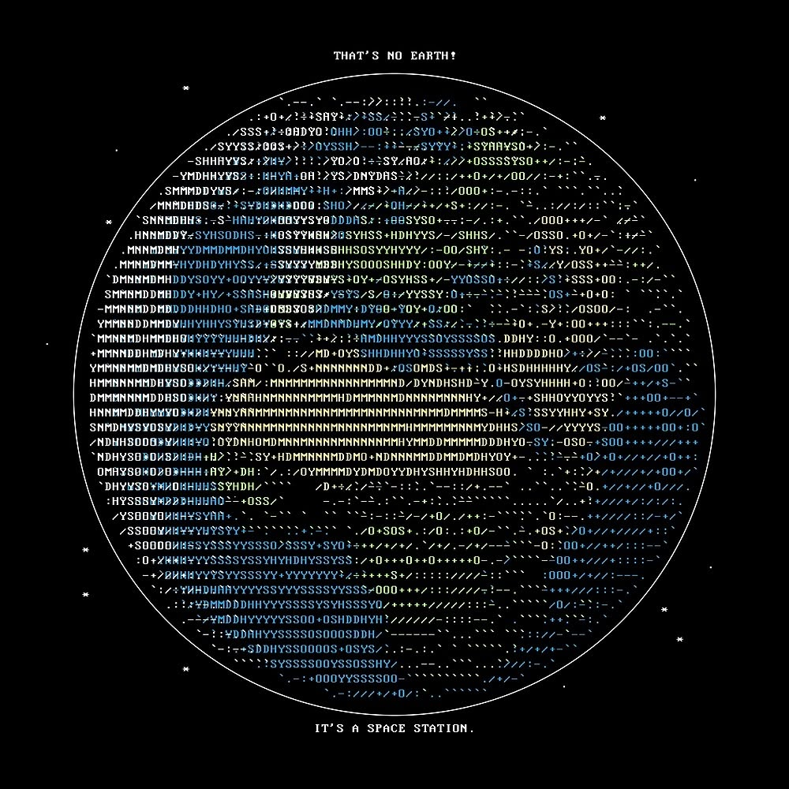

<!-- MasterHead -->

  <!-- Profile Views -->
  

  <!-- Total Stars -->
  

  <!-- Followers -->
  

 

<!-- About Me -->
<h3 align="left">💫 About Me</h3>

  🎓 Information Systems student. 
  ☕ Learning Java and Object-Oriented Programming. 
  🐧 Fedora / Linux enthusiast. 
  💻 Interested in software development and backend. 
  🗄️ Learning databases and PostgreSQL. 
  🧠 Always learning something new. 

<h3 align="left">🧲 Drop me a line:</h3>

  
  
  

 
 

<!-- Languages & Tools -->
<h3 align="center">📚 Languages & Tools I Have Placed My Hands On</h3>

   
   

 

  

 

<!-- Tech Stack -->
<h3 align="center">💻 Tech Stack</h3>

 

<!-- GitHub Status -->
<h3 align="center">🌱 GitHub Status</h3>

   
   
   
  

 

<!-- Recent activity / snake -->
<h3 align="center">🐍 Recent Activity</h3>

  

 

<!-- Interesting Repositories -->

  <h3>⭐️ Interesting Repositories</h3>
  

    
    
  

 

<!-- Ending -->

  

  ⚠️ This README is uniquely designed by <strong>@DanielAlmeid0.</strong>

